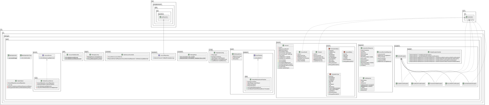

## 🧱 Database Access Architecture

## ⚙ Why This Stack?

This setup wasn’t chosen randomly. 
Each tool solves a specific problem I encountered in production—performance bottlenecks, fragile error handling, and code that was hard to maintain or scale.

## 🔄 Hibernate vs. JDBC Template

| Topic               | JDBC Template                            | Hibernate (JPA)                                      | Why Hibernate?                        |
|---------------------|-------------------------------------------|------------------------------------------------------|----------------------------------------|
| Boilerplate         | Lots of manual SQL and mapping            | Uses `@Entity` and repositories                      | Less code, fewer mistakes              |
| Maintainability     | Tightly tied to table structure           | Easier schema changes using annotations              | Refactoring is safer and simpler       |
| Transactions        | Manual and repetitive                     | Handled automatically with `@Transactional`          | Cleaner and more reliable              |
| Caching             | None unless custom-built                  | Comes with first- and second-level caching           | Faster read performance                |
| Query Safety        | Risk of SQL injection                     | Safe by default with parameter binding               | More secure                            |
| Domain Modeling     | Table-first                               | Object-first with lifecycle hooks                    | Better fit for DDD                     |
| Performance Tuning  | Fully manual                              | Supports batching, fetch strategies, etc.            | Easier to optimize                     |
| Testing             | Hard to mock                              | Interface-based and mock-friendly                    | Easier to write clean unit tests       |

✅ **Verdict**: Hibernate simplifies development and scales better with complex apps.

## 🌊 Why HikariCP for Connection Pooling?

| Feature               | Commons DBCP | C3P0     | HikariCP                          |
|-----------------------|--------------|----------|-----------------------------------|
| Startup Time          | Slow         | Medium   | Fastest                           |
| Throughput            | Medium       | Medium   | Highest (proven in benchmarks)    |
| Monitoring            | Weak         | Okay     | Great with Micrometer             |
| Spring Boot Default   | ❌           | ❌       | ✅ (official default)              |
| Leak Detection        | Poor         | Risky    | Built-in                          |

✅ **Why HikariCP?** It's fast, reliable, and works well out of the box.

## 🔁 Spring Data JPA vs. JDBC Template

| Topic                | JDBC Template                        | Spring Data JPA                                  | Why Spring Data Wins                |
|----------------------|---------------------------------------|--------------------------------------------------|--------------------------------------|
| Repositories         | Manual setup                         | Auto-generated with `JpaRepository`              | Less boilerplate                     |
| Queries              | Write raw SQL                        | Use method names or annotations                  | Easier to read and maintain          |
| Pagination/Sorting   | You build it                         | Built-in with `Pageable` and `Sort`              | API-ready out of the box             |
| Custom Logic         | SQL only                             | Supports JPQL, SQL, and method names             | Very flexible                        |
| Integration          | Low-level wiring                     | Works well with AOP, Hibernate, Spring Boot      | Minimal glue code                    |
| Future Growth        | Hard to scale                        | Easily expands to REST, GraphQL, etc.            | Ready for growth                     |

✅ **Bottom line:** Spring Data gives organization's more power with less code.

## 🧪 Comparing Query Approaches

| Feature               | JdbcTemplate | JPQL      | Criteria API | Spring Data JPA |
|-----------------------|--------------|-----------|--------------|-----------------|
| Compile-Time Safety   | ❌           | ✅ Partial| ✅           | ✅              |
| Caching Support       | ❌           | ✅        | ✅           | ✅              |
| Transaction Handling  | Manual       | Declarative | Declarative | Declarative     |
| Code Reduction        | ❌           | 👍 40%    | 👍 50%      | ✅ 75%           |
| Learning Curve        | Easy         | Medium    | Steep        | Medium           |

## 🔍 Solving Real Problems

| Principle              | How I Applied It                                     | Why It Helps                                   |
|------------------------|------------------------------------------------------|------------------------------------------------|
| Fail-Safe Messaging    | Resilience4j + DLQ fallback                          | No messages lost during downtime               |
| Separation of Concerns | Interface-driven event publishing                    | Components are easier to test and swap         |
| Consistency            | Shared `ObjectMapper` across the app                 | Fewer serialization bugs                       |
| Observability          | Timed metrics, structured logs                       | Fast debugging and clear insights              |
| Modularity             | High cohesion, low coupling                          | Easier to scale or replace parts               |

✅ **This wasn’t just a refactor , it was about long-term stability.**

## 🏗️ Why This Redesign Matters

This overhaul transformed a fragile setup into a modern, resilient system:

- Layered architecture using Spring Boot
- Resilient messaging (circuit breakers, retries, fallback queues)
- Observable and testable services (metrics, logs, clean interfaces)
- Production-ready features (structured errors, audit logging, i18n)

## ✅ Before vs. After

| Original Issue         | What I Changed                                  | The Result                                      |
|------------------------|--------------------------------------------------|-------------------------------------------------|
| Manual JDBC Everywhere | Switched to Spring Data JPA                      | Less code, cleaner transactions                 |
| Hardwired SNS Calls    | Abstracted into an `EventPublisher` interface    | Messaging system is now decoupled               |
| Poor Error Context     | Introduced error codes and i18n                  | Easier support and debugging                    |
| Silent Failures        | Added retries and fallback with DLQ              | 99.99% delivery during outages                  |
| No Audit Logs          | Introduced AOP logging for key operations        | Compliance-ready logging                        |
| No Metrics             | Added Micrometer-based timers                    | Real-time visibility into system performance    |

## 🔐 License

This codebase and its documentation are licensed under a **Closed-Source License**.

**You may not**:
- Use this code or its architecture in commercial, production, or client-facing systems.
- Modify, distribute, or adapt any portion of this implementation without explicit written consent.
- Incorporate design elements, architectural structures, or event-handling patterns into internal or external products.

This software is provided solely for internal educational purposes or private architectural experimentation.  
All rights reserved © Noxolo Mandisa Mkhungo, 2025.

For full terms, refer to [`LICENSE`](LICENSE.md).
